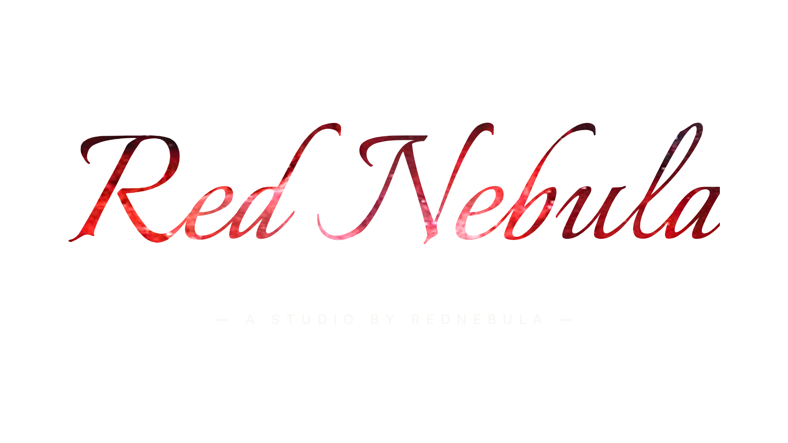

## Hi there 👋

  

- 🔭 I’m currently working on **Incremental Games**
- 🌱 I’m currently learning **JavaScript**
- ⚡ Fun fact: I'm a high school student in Korea 🇰🇷

## 🛠️ Tech Stack

   
   
  

## 🛠️ My Projects
- 🪐 **[Axiom](https://github.com/rednebula100/Axiom)** - An incremental game based on orbital mechanics.

---

  

  

